# Data-Structures-Javascript
Learn what data structures are, why they are useful, and how you can use them effectively.

## Node Implementations

A variety of node implementations are depicted in the diagram. Examine the types of data and how some of the nodes are linked.

## Node Linking

Examine the nodes in the diagram. node_c is only linked to by node_b. If you would like to remove node_b but not node_c, you can’t simply delete the link from node_a to node_b.

## Linked List Example

This linked list contains three nodes (node_a, node_b, and node_c).

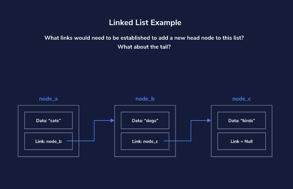

## Linked Lists Adding and Removing Nodes

Depending on the language, nodes which are not referenced are removed automatically. “Removing” a node is equivalent to removing all references to the node.

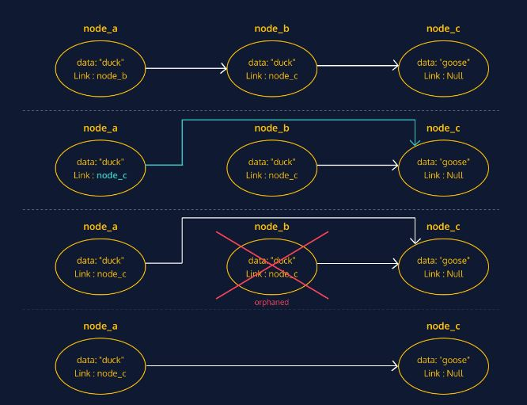

## Doubly Linked Lists

Like a singly linked list, a doubly linked list is comprised of a series of nodes. Each node contains data and two links (or pointers) to the next and previous nodes in the list.

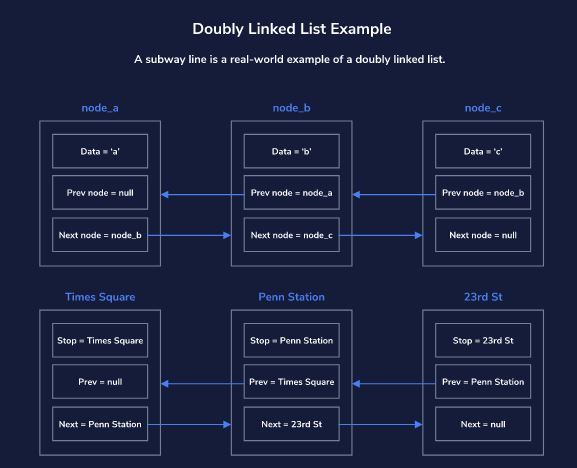

## Adding to the List

In a doubly linked list, adding to the list is a little complicated as we have to keep track of and set the node’s previous pointer as well as update the tail of the list if necessary.

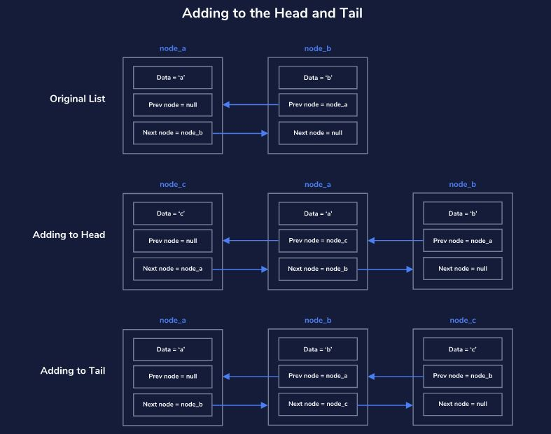

## Removing from the Head and Tail

Due to the extra pointer and tail property, removing the head from a doubly linked list is slightly more complicated than removing the head from a singly linked list. 

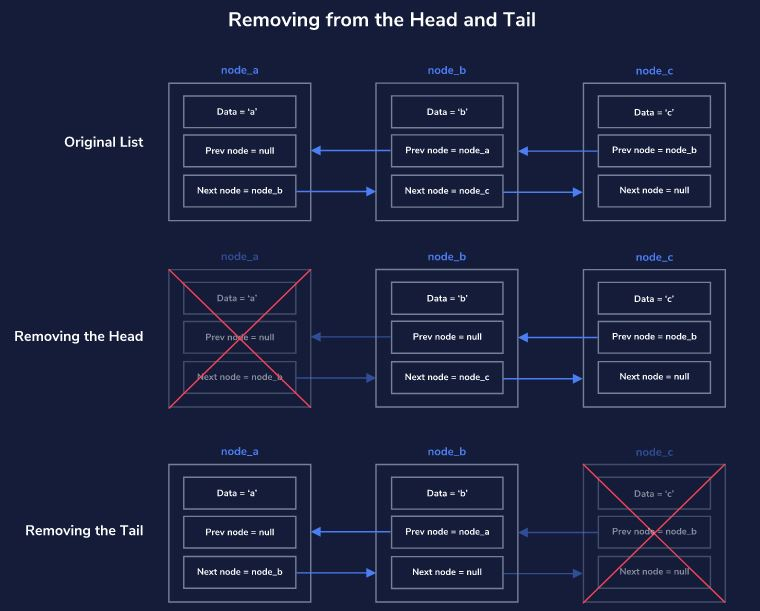

## Removing from the Middle of the List

There is no need to change the pointers of the removed node, as updating the pointers of its neighboring nodes will remove it from the list. If no nodes in the list are pointing to it, the node is orphaned.

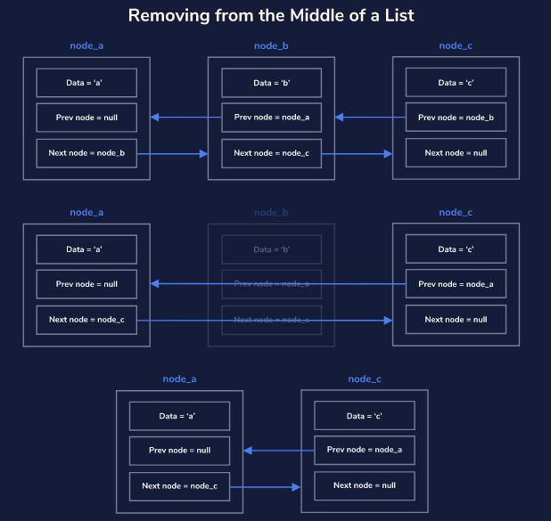

## Trees Introduction

Similar to linked lists and graphs, trees are composed of nodes which hold data. The diagram represents nodes as rectangles and data as text.

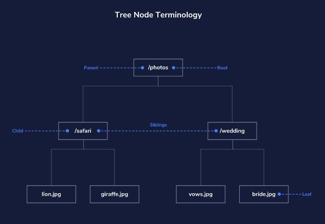

## Tree Varietals

Trees come in various shapes and sizes depending on the dataset modeled. Some are wide, with parent nodes referencing many child nodes.

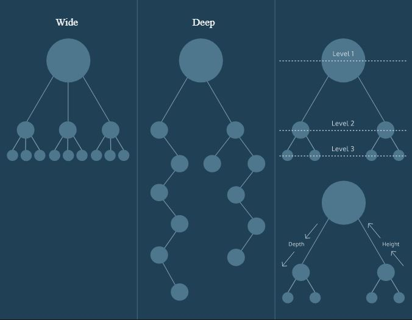

## Binary Search Tree

Constraints are placed on the data or node arrangement of a tree to solve difficult problems like efficient search.

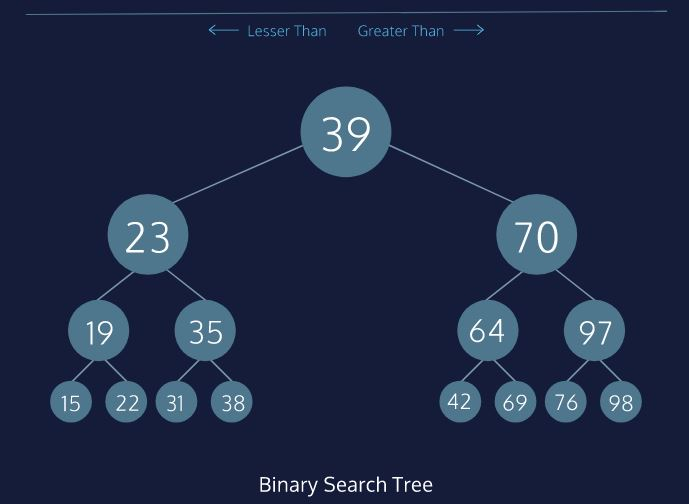

## Introduction to Graphs

Graphs are the perfect data structure for modeling networks, which make them an indispensable piece of your data structure toolkit. They’re composed of nodes, or vertices, which hold data, and edges, which are a connection between two vertices. A single node is a vertex.

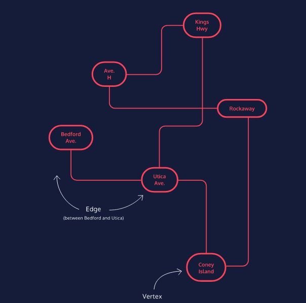

## Directed Graphs

Imagine you’re a superhero escaping a villain’s lair. As you move from perilous room to perilous room, the doors close immediately behind you, barring any return.

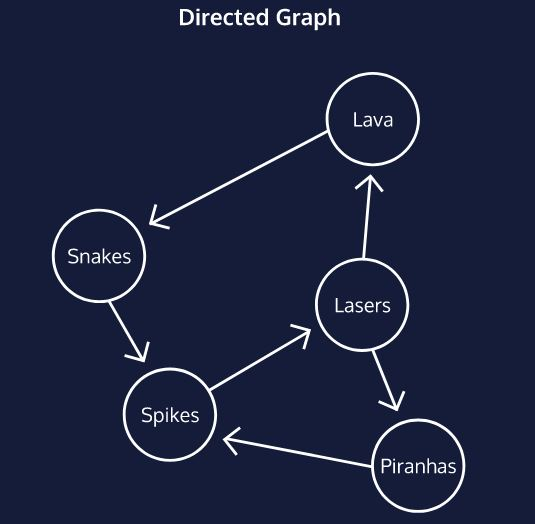

## Representing Graphs

In an adjacency list, each vertex contains a list of the vertices where an edge exists. To find an edge, one looks through the list for the desired vertex.

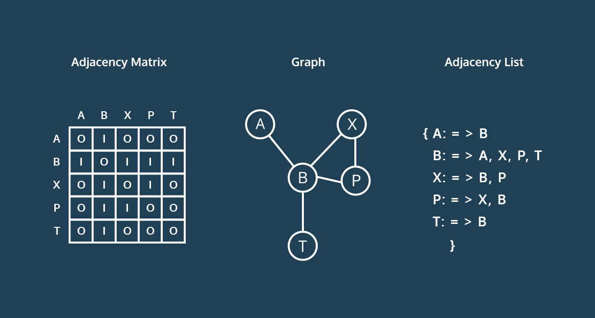

---

[Data Structures and Algorithms in JavaScript](https://egghead.io/courses/data-structures-and-algorithms-in-javascript)

[Data Structure and Algorithms Tutorial](https://www.tutorialspoint.com/data_structures_algorithms/index.htm)
