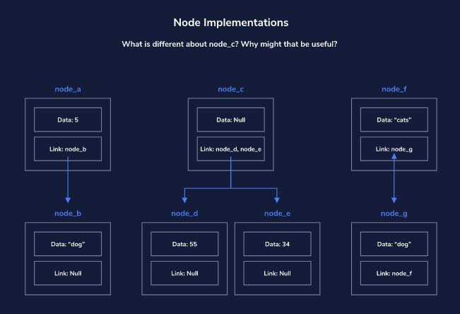
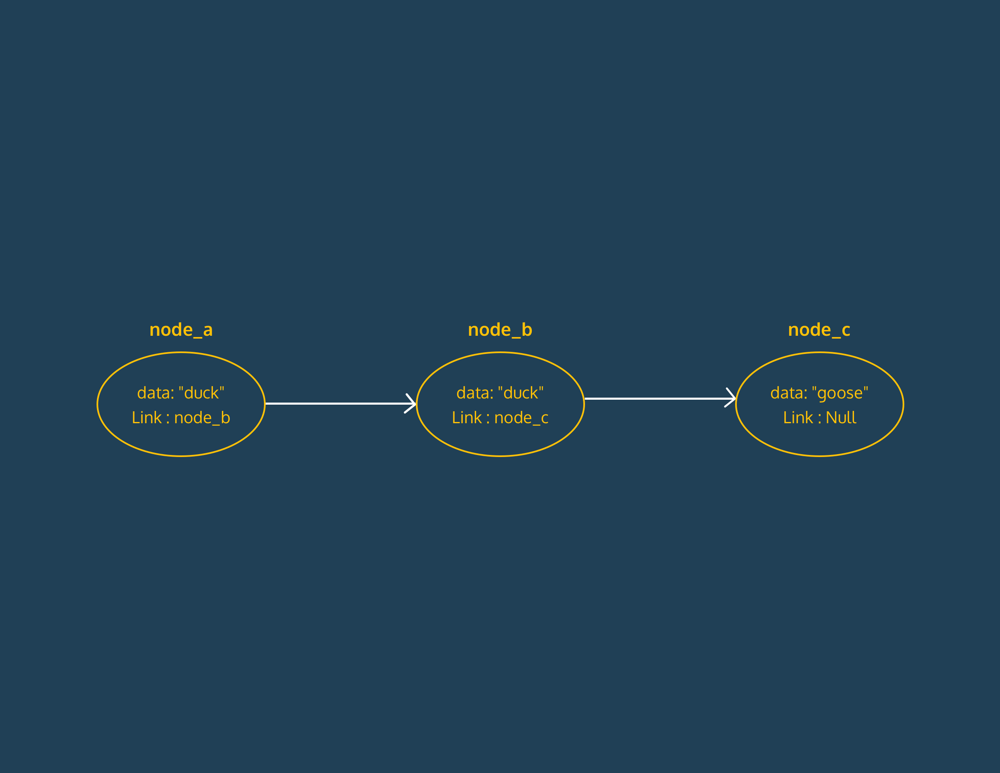

# Data-Structures-Javascript
Learn what data structures are, why they are useful, and how you can use them effectively.

## Node Implementations

## Node Linking

---

[Data Structures and Algorithms in JavaScript](https://egghead.io/courses/data-structures-and-algorithms-in-javascript)

[Data Structure and Algorithms Tutorial](https://www.tutorialspoint.com/data_structures_algorithms/index.htm)
